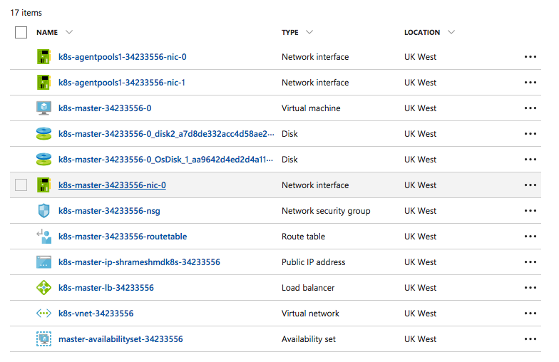

# Azure Container Service - Managed Disks

You can now create clusters with all managed disks, meaning the whole cluster has encryption at rest by default, as can be [read here](https://azure.microsoft.com/en-us/blog/azure-managed-disks-sse/?v=17.23h)

All orchestrators clusters  in version “vlabs” and v20170701 use managed disks by default on all masters and agents with the exception of K8S agents.  If you don’t need Kubernetes persistent volumes, you can even override K8S agents to use managed disks [example here](https://github.com/Azure/acs-engine/blob/master/examples/disks-managed/kubernetes-preAttachedDisks-vmas.json)

## Before using sample template and parameters
 - Replace GEN-UNIQUE and GEN-UNIQUE-2 with different unique strings
 - Replace GEN-SSH-PUB-KEY with valid SSH public key
 - Replace GEN-CLIENT-ID and GEN-CLIENT-SECRET with valid service principal client Id and client secret
 
 ## Deploy using sample template and parameters
 With the provided sample ARM templates and parameters, 
 - Using [az cli](https://github.com/Azure/azure-cli) to deploy
     ```
     az group deployment create -g <your resource group> --template-file azuredeploy.dcos.json --parameters azuredeploy.params.dcos.json
     ``` 
     Note, `<your resource group>` need to be in either `ukwest` or `uksouth` regions. Other regions don't support the new version yet.

## After deployment
If you check the resource groups in [azure portal](https://portal.azure.com/), you will not see any storage accounts under Microsoft Storage, except for DCOS, where you will see one storage account.

## Examples

### - Kubernetes Example
 

### - Docker CE Example
 

### - DCOS Example
#### - Azure Portal 
 

#### - resources.azure.com
   