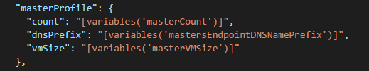

# Microsoft Azure Container Service

## masterVMSize

Azure Container Service API version `2017-07-01` includes support for VMSize under MasterProfile. masterVMSize is the allowed size of VM of master in Azure depending on the orchestrator type. In sample templates we specify the master vmSize like this:

  

The allowed sizes are obtained from [script using az cli](https://github.com/Azure/acs-engine/blob/master/pkg/acsengine/Get-AzureConstants.py) and can refer to [Azure constant data](https://github.com/Azure/acs-engine/blob/master/pkg/acsengine/azureconst.go)

## Allowed master VM sizes
### DCOS
"Standard_A10",
"Standard_A11",
"Standard_A2",
"Standard_A3",
"Standard_A4",
"Standard_A5",
"Standard_A6",
"Standard_A7",
"Standard_A8",
"Standard_A9",
"Standard_D11",
"Standard_D11_v2",
"Standard_D11_v2_Promo",
"Standard_D12",
"Standard_D12_v2",
"Standard_D12_v2_Promo",
"Standard_D13",
"Standard_D13_v2",
"Standard_D13_v2_Promo",
"Standard_D14",
"Standard_D14_v2",
"Standard_D14_v2_Promo",
"Standard_D15_v2",
"Standard_D2",
"Standard_D2_v2",
"Standard_D2_v2_Promo",
"Standard_D3",
"Standard_D3_v2",
"Standard_D3_v2_Promo",
"Standard_D4",
"Standard_D4_v2",
"Standard_D4_v2_Promo",
"Standard_D5_v2",
"Standard_D5_v2_Promo",
"Standard_DS13",
"Standard_DS13_v2",
"Standard_DS13_v2_Promo",
"Standard_DS14",
"Standard_DS14_v2",
"Standard_DS14_v2_Promo",
"Standard_DS15_v2",
"Standard_DS5_v2",
"Standard_DS5_v2_Promo",
"Standard_F16",
"Standard_F8",
"Standard_G1",
"Standard_G2",
"Standard_G3",
"Standard_G4",
"Standard_G5",
"Standard_GS2",
"Standard_GS3",
"Standard_GS4",
"Standard_GS5",
"Standard_H16",
"Standard_H16m",
"Standard_H16mr",
"Standard_H16r",
"Standard_H8",
"Standard_H8m",
"Standard_L16s",
"Standard_L32s",
"Standard_L4s",
"Standard_L8s",
"Standard_M128ms",
"Standard_M128s",
"Standard_M64ms",
"Standard_NC12",
"Standard_NC24",
"Standard_NC24r",
"Standard_NC6",
"Standard_NV12",
"Standard_NV24",
"Standard_NV6"

### Swarm, Kubernetes, and DockerCE
"Standard_A10",
"Standard_A11",
"Standard_A2",
"Standard_A2_v2",
"Standard_A2m_v2",
"Standard_A3",
"Standard_A4",
"Standard_A4_v2",
"Standard_A4m_v2",
"Standard_A5",
"Standard_A6",
"Standard_A7",
"Standard_A8",
"Standard_A8_v2",
"Standard_A8m_v2",
"Standard_A9",
"Standard_D11",
"Standard_D11_v2",
"Standard_D11_v2_Promo",
"Standard_D12",
"Standard_D12_v2",
"Standard_D12_v2_Promo",
"Standard_D13",
"Standard_D13_v2",
"Standard_D13_v2_Promo",
"Standard_D14",
"Standard_D14_v2",
"Standard_D14_v2_Promo",
"Standard_D15_v2",
"Standard_D2",
"Standard_D2_v2",
"Standard_D2_v2_Promo",
"Standard_D3",
"Standard_D3_v2",
"Standard_D3_v2_Promo",
"Standard_D4",
"Standard_D4_v2",
"Standard_D4_v2_Promo",
"Standard_D5_v2",
"Standard_D5_v2_Promo",
"Standard_DS11",
"Standard_DS11_v2",
"Standard_DS11_v2_Promo",
"Standard_DS12",
"Standard_DS12_v2",
"Standard_DS12_v2_Promo",
"Standard_DS13",
"Standard_DS13_v2",
"Standard_DS13_v2_Promo",
"Standard_DS14",
"Standard_DS14_v2",
"Standard_DS14_v2_Promo",
"Standard_DS15_v2",
"Standard_DS2",
"Standard_DS2_v2",
"Standard_DS2_v2_Promo",
"Standard_DS3",
"Standard_DS3_v2",
"Standard_DS3_v2_Promo",
"Standard_DS4",
"Standard_DS4_v2",
"Standard_DS4_v2_Promo",
"Standard_DS5_v2",
"Standard_DS5_v2_Promo",
"Standard_F16",
"Standard_F16s",
"Standard_F2",
"Standard_F2s",
"Standard_F4",
"Standard_F4s",
"Standard_F8",
"Standard_F8s",
"Standard_G1",
"Standard_G2",
"Standard_G3",
"Standard_G4",
"Standard_G5",
"Standard_GS1",
"Standard_GS2",
"Standard_GS3",
"Standard_GS4",
"Standard_GS5",
"Standard_H16",
"Standard_H16m",
"Standard_H16mr",
"Standard_H16r",
"Standard_H8",
"Standard_H8m",
"Standard_L16s",
"Standard_L32s",
"Standard_L4s",
"Standard_L8s",
"Standard_M128ms",
"Standard_M128s",
"Standard_M64ms",
"Standard_NC12",
"Standard_NC24",
"Standard_NC24r",
"Standard_NC6",
"Standard_NV12",
"Standard_NV24",
"Standard_NV6"

# Example template and parameter files for all three orchestrators
## DCOS
### [azuredeploy.dcos.json](./azuredeploy.dcos.json)
### [azuredeploy.params.dcos.json](./azuredeploy.params.dcos.json)

## Kubernetes
### [azuredeploy.kubernetes.json](./azuredeploy.kubernetes.json)
### [azuredeploy.params.kubernetes.json](./azuredeploy.params.kubernetes.json)

## DockerCE
### [azuredeploy.dockerce.json](./azuredeploy.dockerce.json)
### [azuredeploy.params.dockerce.json](./azuredeploy.params.dockerce.json)

