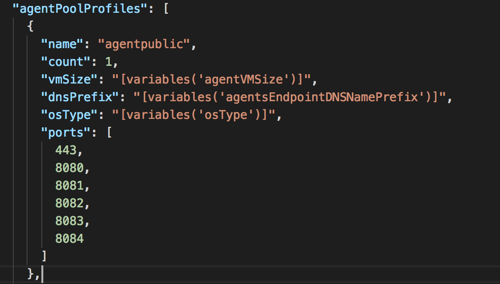
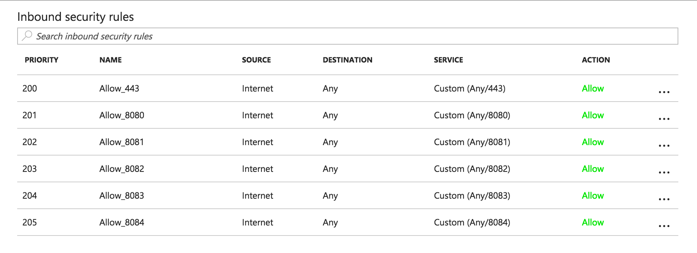

# Azure Container Service - Ports
`ports` is now supported in ACS since version 2017-07-01. It will be one of the optional attribute in the `agentPoolProfile` definition. Ports need to conform the following rules
- All ports must be unique
- they must be specified with a agentDnsNamePrefix
- range is 1 <= x <= 65535

In this sample templates we specify the public agent pool's ports like this


With the provided sample ARM templates and parameters, 
- you could using az cli to deploy like this
    ```
    az group deployment create -g <your resource group> --template-file azuredeploy.dcos.json --parameters azuredeploy.params.dcos.json
    ``` 
    Note, `<your resource group>` need to be in either `ukwest` or `uksouth` regions. Other regions don't support the new version yet.

- Or simply click <a href="https://portal.azure.com/#create/Microsoft.Template/uri/https%3A%2F%2Fraw.githubusercontent.com%2FAzure%2Facs%2Fmaster%2Fdocs%2FPorts%2Fazuredeploy.dcos.json" target="_blank">
    
</a>

After deployment finished, you should be able to check the public agent pool's nsg rules.
